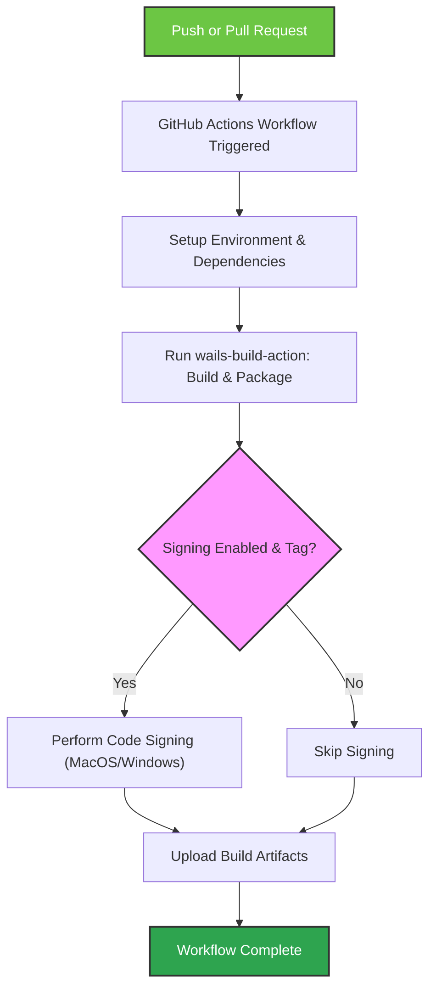

# Running Your First Build

This guide walks you through triggering your first GitHub workflow using the `wails-build-action`. From initiating a push or pull request, to observing workflow progress and locating your build artifacts, you will learn how to successfully run and validate your first Wails app build.

---

## 1. Triggering Your First Build

Your initial build starts automatically when you push changes or create a pull request on your GitHub repository containing the `wails-build-action` workflow.

### What to do:

1. **Push your latest commits** or open a new Pull Request in your repository where the action is configured.
2. Navigate to the **Actions** tab on your GitHub repository page.
3. Select the workflow run triggered by your push or PR.

<Check>
Ensure your workflow YAML includes `wails-build-action`. If you haven't set it up yet, see [Adding the Action to GitHub Workflows](../install-configure/adding-action-github).
</Check>

---

## 2. Understanding the Workflow Execution

### Workflow Progress
- The action installs required dependencies: Go, Node.js, and optionally Deno.
- It configures build options based on the provided inputs, such as platform targets and code obfuscation.
- The build runs your Wails application source code, producing platform-specific binaries.
- Optionally, code signing is executed if enabled, particularly for macOS and Windows.
- Artifacts are uploaded to GitHub Actions for easy access.

### Tracking Logs
- Within the workflow run details, watch the progress logs step-by-step.
- Look for any errors carefully and address them by checking configuration or environment settings.

<Tip>
Logs typically provide clear messages indicating whether Go, Node.js installation succeeded and when the build starts.
</Tip>

---

## 3. Verifying a Successful Build

A completed build run will indicate success in GitHub Actions with green checkmarks on all steps.

### What Does Success Look Like?
- The build step finishes without errors.
- Binaries for the targeted platforms appear in the uploaded artifacts.
- If signing is enabled on macOS/Windows (usually on tag builds), signed installers or zipped apps are included.

<Table>
  <thead>
    <tr><th>Success Indicator</th><th>Details</th></tr>
  </thead>
  <tbody>
    <tr><td>GitHub Action Status</td><td>All job steps completed successfully.</td></tr>
    <tr><td>Artifacts</td><td>Build output files uploaded. Check under the "Artifacts" section in the Actions run.</td></tr>
    <tr><td>Build Logs</td><td>Show compilation with no error messages.</td></tr>
  </tbody>
</Table>

---

## 4. Accessing Your Build Artifacts

Once your workflow has finished:

1. In the workflow run summary, scroll down to the **Artifacts** section.
2. Click on your build artifact name (e.g., `Wails Build Linux wailsApp`).
3. Download the zipped artifacts containing your compiled binaries and installers.

<Note>
Artifacts include platform-specific binaries located in the `bin` directory inside the archive.
</Note>

---

## 5. Interpreting the Workflow Output

- **Build logs** show each step executed (dependency installs, build start, signing step).
- Look for lines noting `wails build` running with flags matching your input configuration.
- Code signing steps appear only on macOS and Windows if signing inputs are set and on tag events.

<Tip>
Use the workflow's log filters to jump to sections like "Build App" or "Sign Windows binaries" for focused troubleshooting.
</Tip>

---

## 6. Troubleshooting Common Issues

<AccordionGroup title="Troubleshooting Tips for First Build Runs">
<Accordion title="Build Failed - Dependency Installation Errors">
Check your runner environment and workflow configuration. On Linux, ensure the distribution is supported and necessary packages like GTK and WebKit are installed.
</Accordion>
<Accordion title="Artifacts Not Found After Successful Build">
Verify that the `package` input is set to `true` in your workflow YAML to enable artifact uploading.
</Accordion>
<Accordion title="Code Signing Step Skipped on macOS/Windows">
Ensure signing inputs are correctly provided and your workflow is triggered by a tag event, which triggers signing flows.
</Accordion>
</AccordionGroup>

---

## 7. Next Steps After Your First Build

- Visit [Validating Output & Artifacts](../first-run-validation/validating-artifacts) to test and deploy your compiled binaries.
- Explore [Configuring Build Options](../../install-configure/build-options-configuration) to customize builds.
- If you sign your applications, see [Setting Up Code Signing (MacOS & Windows)](../../install-configure/code-signing-setup).
- For ongoing maintenance, check [Troubleshooting Common Setup Issues](../first-run-validation/common-setup-issues).

## Summary
Running your first build triggers an automated GitHub workflow that compiles your Wails app, optionally signs it, and uploads artifacts for you to download. Monitoring logs and artifacts in GitHub Actions helps ensure your build config is correct and successful.

---

## Additional Resources
- [Adding the Action to GitHub Workflows](../install-configure/adding-action-github) — How to add the action to your CI
- [Configuring Build Options](../../install-configure/build-options-configuration) — Customize platform targets, naming, obfuscation
- [Setting Up Code Signing](../../install-configure/code-signing-setup) — MacOS/Windows signing preparation
- [Validating Output & Artifacts](../first-run-validation/validating-artifacts) — How to test and use your builds
- [Troubleshooting Common Setup Issues](../first-run-validation/common-setup-issues) — Resolve frequent errors

---

## Visual Workflow Overview

---

This completes your first build run. You are now ready to download and test your Wails app binaries built automatically through your GitHub workflow.

