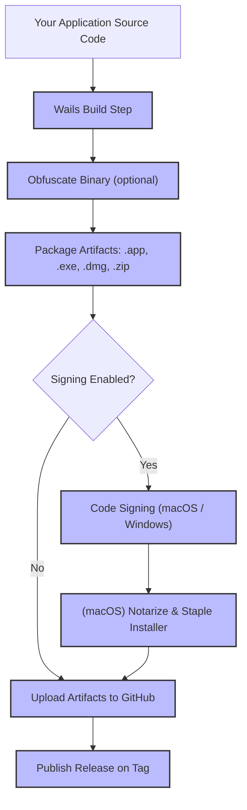

# Core Concepts & Terminology

Understanding the specific terms and concepts used throughout the **dAppServer/wails-build-action** documentation is crucial for configuring, running, and troubleshooting builds efficiently. This page defines essential vocabulary related to Wails builds, artifact packaging, code obfuscation, code signing, supported platform targets, and release workflows. Clear comprehension empowers you to interpret action parameters and logs confidently, preventing misconfiguration and accelerating your development process.

---

## Why This Matters

When building cross-platform desktop applications using Wails with GitHub Actions automation, you encounter various domain-specific terms that directly impact how your CI/CD pipelines behave. Grasping these terms ensures you make informed decisions about build configuration, signing credentials, artifact management, and release steps — all vital for smooth deployment and security compliance.

---

## Key Terminology

### 1. Wails Build
- **Definition:** Running the Wails CLI tool to compile your Go backend with your frontend assets into a runnable desktop application.
- **What It Does:** Combines Go code, frontend bundle, and platform-specific connectors into a binary.
- **Why It Matters:** This is the primary compilation step automated by the action to create executable app artifacts.

### 2. Artifact Packaging
- **Definition:** Bundling executables, installers, and related files generated by the build into distributable packages.
- **Common Forms:** Zip files, installer executables (.exe), macOS packages (.pkg), disk images (.dmg).
- **Benefit:** Makes it easy to distribute, upload, or deploy your built application.

### 3. Obfuscation
- **Definition:** A process to transform the compiled binary into a less readable form to protect your source code from reverse engineering.
- **Applied During:** The Go build phase if `build-obfuscate` is enabled.
- **User Benefit:** Enhances security by safeguarding intellectual property without altering functionality.

### 4. Code Signing
- **Definition:** Digitally signing your binaries and installers to prove authenticity and integrity.
- **Platforms Supported:** macOS and Windows.
- **Why You Need It:** Avoids OS warnings or installation blocks by verifying your app’s origin and ensuring it hasn't been tampered with.
- **Related Terms:** 
  - **Certificates:** Digital credentials used for signing (App, Installer).
  - **Provisioning:** Importing and configuring certificates in your build environment.

### 5. Platform Targets
- **Definition:** The OS and architecture combination for which your build is intended.
- **Examples:** `linux/amd64`, `darwin/universal`, `windows/amd64`.
- **Purpose:** Allows cross-compiling builds targeted at different platforms from a single CI workflow.

### 6. Release Workflows
- **Definition:** Automated processes triggered by Git tags or workflow events that build, sign, package, and publish app releases.
- **Includes:** Uploading artifacts to GitHub Actions, creating GitHub Releases, notarization (macOS).
- **Why Important:** Streamlines consistent and repeatable delivery of your desktop applications to end-users.

---

## Understanding Action Inputs and Logs Using These Terms

When configuring the GitHub Action or interpreting workflow logs, these terms consistently appear:

- `build-name`: Specifies the output binary name for the Wails build.
- `build-platform`: Selects the OS and architecture to cross-compile.
- `build-obfuscate`: Enables Go code obfuscation to protect the binary.
- `sign`: Enables code signing for macOS or Windows, requiring certificates.
- `package`: Controls whether artifacts are uploaded and tagged builds published.

Example snippet from workflow logs:
```
Building wailsApp for darwin/universal with obfuscation enabled
Signing macOS app with provided certificate
Packaging into wailsApp.dmg and zip archive
Uploading artifacts for release tag v1.0.0
```

Each phrase maps directly to the concepts explained here, making it easier to spot the stage and status of your build.

---

## Best Practices & Tips

- Always set your `build-name` clearly to avoid confusion with multiple artifacts.
- Use `build-platform` matrix builds to automate multi-OS releases.
- Enable `build-obfuscate` if protecting your Go source code is a priority.
- Prepare and validate signing certificates before enabling code signing.
- Use `package` toggle to control when uploads and releases should happen, e.g., disable during intermediate test builds.

---

## Troubleshooting Common Confusions

<AccordionGroup title="Common Terminology Questions">
<Accordion title="What does 'signing macOS app' exactly involve?">
Signing the macOS binary means applying a digital certificate to your built `.app` bundle to verify it comes from a trusted developer. It requires certificates and passwords configured via action inputs and enables OS Gatekeeper compatibility.
</Accordion>
<Accordion title="Why is obfuscation optional and when to use it?">
Obfuscation slows reverse engineering but adds build complexity. Use it if source code confidentiality outweighs the need for quick builds or debugging.
</Accordion>
<Accordion title="What is the difference between packaging and uploading artifacts?">
Packaging refers to creating distributable installer or archive files. Uploading artifact means pushing those files into GitHub workflow storage or releases for distribution.
</Accordion>
<Accordion title="How do platform targets affect build workflows?">
They allow you to cross-compile for different OSes and CPU architectures from a single workflow run, enabling multi-platform desktop app releases.
</Accordion>
</AccordionGroup>

---

## Visualizing the Release Workflow with Core Concepts



This flow shows how core concepts connect in the action's lifecycle from code to release.

---

## Next Steps

- To put these concepts in action, visit the [Adding the Action to GitHub Workflows](overview/architecture-and-concepts/integration-with-github-actions) page.
- For detailed signing setups, consult [Setting Up Code Signing (MacOS & Windows)](getting-started/install-configure/code-signing-setup).
- Explore configuration examples in [Configuration & Customization Options](overview/feature-quicktour/configuration-and-customization).

Grasping these core concepts is your foundation for mastering automated builds with dAppServer/wails-build-action.


---

<Check>
Remember: Mastering terminology clarifies configuration choices and builds confidence — start here to unlock the full potential of your CI/CD workflows with Wails.
</Check>

---