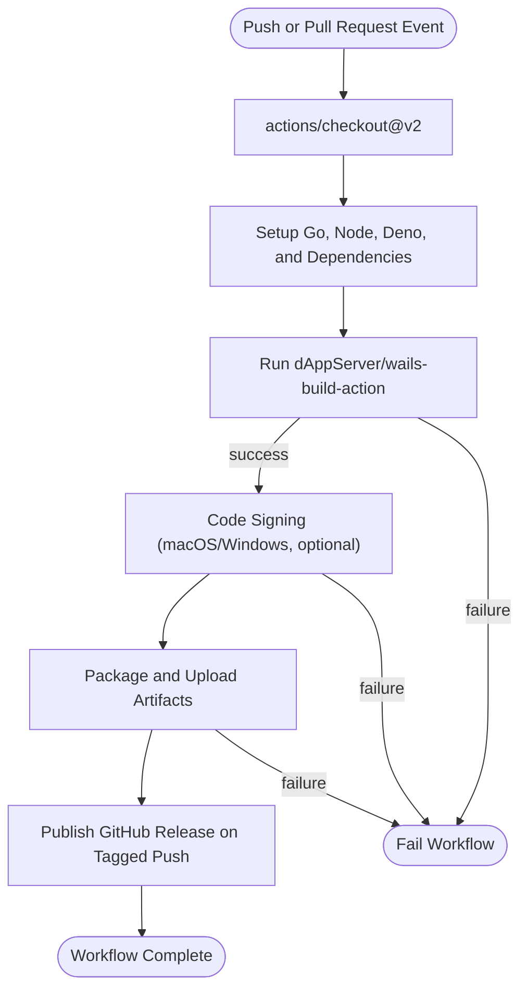

# Integration with GitHub Actions & Ecosystem

## Seamlessly Embedding dAppServer/wails-build-action into Your CI/CD Pipeline

Building desktop applications with [Wails.io](https://wails.io) is a complex process involving multiple OS targets, dependency management, code signing, packaging, and release publishing. The dAppServer/wails-build-action automates this complexity within GitHub Actions, streamlining your build workflows into a single, replicable step.

This page explains exactly how to integrate the GitHub Action into your workflows, configure its parameters for your needs, understand its outputs, and manage compatibility with Wails versions and multiple build environments.

---

## Why Integrate This Action?

Modern cross-platform applications require robust, automated build pipelines for consistent releases. Integrating dAppServer/wails-build-action into GitHub Actions empowers you to:

- Automatically provision Go, Node.js, Deno (optional), and required build dependencies
- Build your Wails.io application binaries across Linux, Windows, and macOS platforms
- Include optional obfuscation for production security
- Perform macOS and Windows code signing within the workflow
- Package builds, upload artifacts, and publish GitHub releases on tagged commits
- Customize build flags, Go compiler tags, and Webview2 installation modes

Imagine simply pushing your code and having trusted builds flowing into your release repositories with all signing and packaging handled smoothly.

---

## How It Fits: Action Inputs and Configuration

The action exposes rich inputs that map directly to user intent for building a Wails app. Understanding these options lets you tailor your CI pipeline precisely.

| Input Name                        | Default           | Description                                                                                                     |
|----------------------------------|-------------------|-----------------------------------------------------------------------------------------------------------------|
| `build-name`                     | *None* (required) | Name of the output binary (mandatory). Used in artifact naming and packaging.                                   |
| `build-platform`                 | `darwin/universal`| Target platform(s) for the build such as `linux/amd64`, `windows/amd64`, or `darwin/universal`.                  |
| `build`                         | `true`            | Whether to perform the build step (`wails build`) or skip it.                                                 |
| `build-obfuscate`               | `false`           | Enable obfuscation of the binary to protect source code.                                                      |
| `build-tags`                   | `false` or `''`     | Go compiler build tags, strongly quoted; supports multiple tags separated by space or comma.                   |
| `nsis`                         | `false`           | Builds a Windows NSIS installer along with the binary if true.                                                |
| `package`                      | `true`            | Uploads build artifacts and publishes GitHub Releases on tagged commits.                                       |
| `sign`                        | `false`           | Enables code signing (MacOS and/or Windows) after build completes.                                            |
| `wails-version`               | `latest`          | Wails CLI version to install and use for the build. Pin to a specific version to avoid breaking changes.       |
| `wails-build-webview2`        | `download`        | How Webview2 is installed on Windows builds, options: `download`, `embed`, `browser`, or `error`.              |
| `go-version`                  | `1.23`            | Go programming language version for build environment.                                                        |
| `node-version`                | `18.x`            | Node.js version installed to handle frontend assets.                                                          |
| `deno-build`                 | `''`              | Optional Deno compile command to run as part of the workflow for Deno-based server binaries.                   |
| `deno-working-directory`     | `'.'`             | Working directory for the Deno commands.                                                                      |
| `sign-macos-app-id`          | `''`              | MacOS app signing certificate ID (used if signing is enabled).                                                |
| `sign-macos-apple-password`  | `''`              | Password for Apple developer account for notarization/signing.                                               |
| `sign-windows-cert`          | `''`              | Windows signing certificate contents for code signing.                                                        |
| `sign-windows-cert-password` | `''`              | Password for the Windows signing certificate.                                                                  |

### Example: Minimal Build

```yaml
- uses: dAppServer/wails-build-action@v3
  with:
    build-name: myWailsApp
    build-platform: linux/amd64
```

This will run a basic build for Linux AMD64 with all defaults.

### Example: Full Multi-Platform, Obfuscated, Signed Build

```yaml
- uses: dAppServer/wails-build-action@v3
  with:
    build-name: myWailsApp
    build-platform: windows/amd64
    build-obfuscate: true
    sign: true
    sign-windows-cert: ${{ secrets.WINDOWS_CERT }}
    sign-windows-cert-password: ${{ secrets.WINDOWS_CERT_PWD }}
    package: true
```

This inputs configuration builds the app for Windows amd64, obfuscates the binary, signs it, and packages the artifacts.

---

## Embedding Into Your GitHub Workflow

The action fits neatly inside job steps with environment setup and matrix strategies for multi-platform builds. Here is a simplified snippet showing a typical usage:

```yaml
name: Build and Release

on:
  push:
    tags:
      - 'v*'

jobs:
  build:
    strategy:
      matrix:
        platform: [linux/amd64, windows/amd64, darwin/universal]
        include:
          - platform: linux/amd64
            os: ubuntu-latest
          - platform: windows/amd64
            os: windows-latest
          - platform: darwin/universal
            os: macos-latest
    runs-on: ${{ matrix.os }}
    steps:
      - uses: actions/checkout@v2
      - uses: dAppServer/wails-build-action@v3
        with:
          build-name: myApp
          build-platform: ${{ matrix.platform }}
          build-obfuscate: true
          package: true
          sign: true
          sign-macos-app-id: ${{ secrets.MACOS_APP_ID }}
          sign-macos-apple-password: ${{ secrets.APPLE_PASSWORD }}
```

This configures a build matrix across three platforms, handling obfuscation, signing, packaging, and tagging releases.

---

## Outputs and Artifacts

The action uploads compiled binaries and installers (where applicable) as workflow artifacts, giving you centralized, versioned access.

- On regular pushes: artifacts are uploaded under names like `Wails Build ${{ runner.os }} ${{ inputs.build-name }}`
- On tag-based pushes: artifacts are also attached to the GitHub Release for easy consumption.

You will find builds inside the workflow UI artifact tab, named following your `build-name` and OS naming conventions.

---

## Compatibility, Version Pinning, and Known Issues

### Wails Version
Pin `wails-version` to stable versions (e.g., `v2.9.0`) to avoid unexpected breakage. For example, version `v2.10.0` is known to have issues—use:

```yaml
wails-version: 'v2.9.0'
```

### Go and Node Version
Ensure your choice of `go-version` and `node-version` aligns with your Wails app code dependencies. Defaults are `1.23` for Go and `18.x` for Node.js.

### Webview2 on Windows
You can configure how Webview2 is installed to reduce build failures:

- `download` (default): Downloads before build
- `embed`: Embeds into build
- `browser`: Uses installed version
- `error`: Fails build if Webview2 is not found

### Linux Dependencies
The action installs required packages per detected Linux distro (`20.04`, `22.04`, or `24.04`). Unsupported distros will fail with a clear error.

### Code Signing Credentials
Ensure signing secrets and certificates are correctly encrypted and configured within GitHub secrets. Misconfiguration will cause signing steps to fail.

### Known Issues
Report any reproducible bugs or issues, especially with Wails versions, on the GitHub repo issues page: [dAppServer/wails-build-action Issues](https://github.com/dAppServer/wails-build-action/issues).

---

## Practical Tips and Best Practices

- **Use matrix builds with caution:** Running many parallel OS/platform builds speeds release but can stress GitHub runner quotas.
- **Pin all major versions:** The action depends on Go, Node, and Wails versions. Pinning minimizes surprises.
- **Keep secrets safe:** Restrict read access on your signing certificates and passwords.
- **Combine with Testing:** Integrate unit and UI tests before this action for quality gates.
- **Use package=false for Debugging:** Disable artifact uploads during workflow debug runs to save time.

---

## Visual Workflow Overview



This flow illustrates the action's core lifecycle from code push to artifact publication.

---

## Next Steps

- Refer to **[Adding the Action to GitHub Workflows](../getting-started/install-configure/adding-action-github.md)** to learn hands-on setup.
- Explore **[Setting Up Code Signing (MacOS & Windows)](../getting-started/install-configure/code-signing-setup.md)** for signing your apps securely.
- Check out **[Configuration & Customization Options](../overview/feature-quicktour/configuration-and-customization.md)** to fine-tune the build.

With this guidance, you are fully equipped to embed the dAppServer/wails-build-action confidently into your GitHub automation pipelines.

---